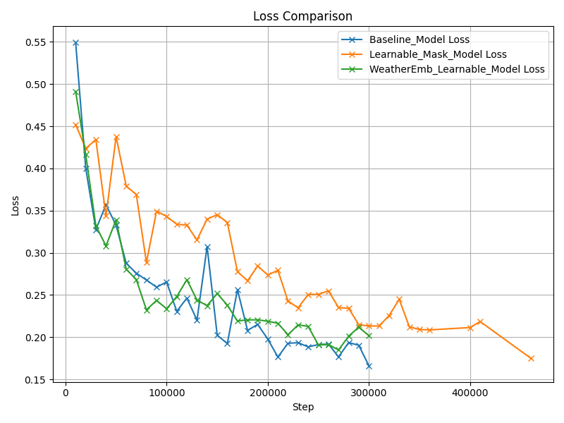
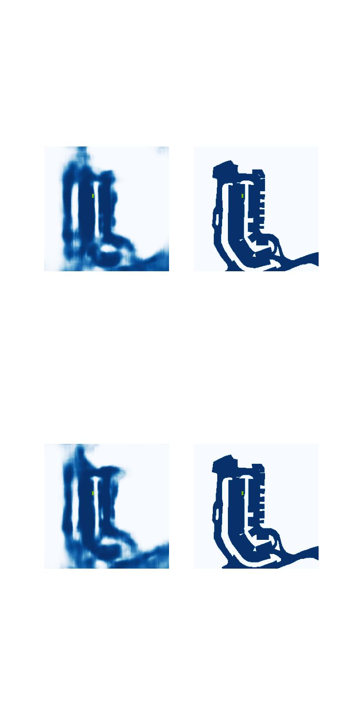

# TransFuseGrid: Transformer-based Lidar-RGB fusion for semantic grid prediction

Semantic grids provide an efficient and structured representation of the environment for autonomous driving and mobile robotics applications. While LiDAR sensors are widely adopted in modern systems, most existing semantic grid prediction approaches still rely predominantly on RGB camera data. In this paper, we present TransFuseGrid, a transformer-based multimodal fusion framework that integrates LiDAR point clouds and multi-view RGB images for dense semantic grid prediction. Our method first projects both input modalities into a common bird’s-eye-view (BEV) frame to create unified top-view embeddings. These embeddings are then fused at multiple scales using cross-modal Transformers enhanced with dynamic attention mechanisms, where learnable attention masks enable adaptive reweighting of features across modalities. Furthermore, we introduce weather-conditioned embeddings that allow the fusion process to dynamically adjust sensor contributions based on environmental context such as rain, fog, or nighttime conditions. A lightweight decoder then transforms the fused BEV features into high-resolution semantic grids, predicting key classes such as drivable areas, walkways, vehicles, and lane dividers. We evaluate TransFuseGrid on the nuScenes dataset and show that it consistently outperforms RGB-only, LiDAR-only, and naive fusion baselines. In particular, our dynamic attention and weather-aware conditioning strategies lead to sharper object boundaries, improved drivable-area segmentation, and higher Intersection-over-Union (IoU) scores, especially under challenging weather and lighting scenarios.


## Comparison with baseline TransfuseGrid Model
### Results on validation IoU


### Results on cross entropy loss




### Qualitative results
We evaluate TransFuseGrid across three configurations: (1) a static-fusion baseline, (2) a Learnable_Mask_Model with dynamic attention (without weather conditioning), and (3) the full WeatherEmb_Learnable_Model with dynamic attention and weather-conditioned embeddings. Performance is measured by IoU and cross-entropy loss across 300,000 training steps.

The WeatherEmb_Learnable_Model achieves a peak IoU of 0.77, similar to the baseline model, while the Learnable_Mask_Model plateaus around 0.71. The addition of weather embeddings accelerates early-stage learning, improving convergence stability and robustness.

The WeatherEmb_Learnable_Model achieves a final loss of ~0.16, on par with the baseline, and outperforms the Learnable_Mask_Model (~0.26). The dynamic attention in the WeatherEmb_Learnable_Model stabilizes training and enhances semantic accuracy.

These results show that integrating weather-conditioned embeddings improves fusion efficiency and performance, enabling sharper object boundaries and better generalization.

### Comparison results with Baseline Model

## Baseline Results


## Learnable Mask + Weather Embedding Results



## Use TransFuseGrid

In order to train TransFuseGrid for Drivable_area class, use the following command:

```
python main.py train_multigpu_2T -s trainval -c ./configs/config_nT_da.py --logdir ./runs/v2T_da --gpus 8
```

This script allows training using classes: vehicle, drivable_area, walkway, lane_divider, ped_crossing and stop_line.

## Acknowledgement

This model repo is created using multi-modal fuser transformer based on Prakash et al work [TransFuser](https://github.com/autonomousvision/transfuser) and TransFuseGrid: Transformer-based Lidar-RGB fusion for semantic grid prediction based on Gustavo Salazar-Gomez et al work [TFGrid](https://github.com/gsg213/TFGrid)
